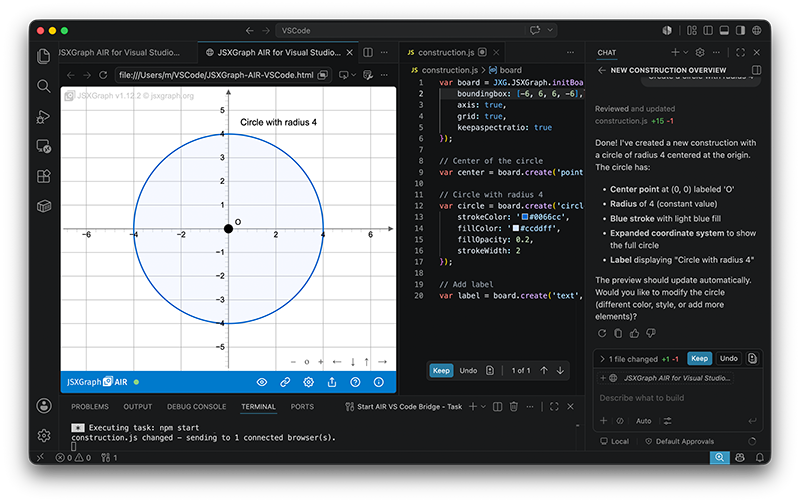

# JSXGraph AIR for Visual Studio Code

## Artificial Intelligence Renderer – Powered by JSXGraph

Create JSXGraph illustrations with AI assistance, right from your editor. JSXGraph AIR for Visual Studio Code turns a browser tab into a live preview for your JSXGraph constructions: let GitHub Copilot (or any AI assistant in VS Code) write the code in `construction.js` — every save instantly updates the rendered construction.

Additional libraries such as MathJax or custom CSS can be added via `header.js`, guarded by a configurable allowlist. When you're done, export your work as a single self-contained HTML file or copy it straight to the clipboard.

## Features

- *Works with or without AI* — the renderer simply reflects the current file content. Every edit in the editor is applied on save: handwritten code, pasted snippets, and AI-generated constructions are all treated exactly the same.
- *Live preview* — file changes appear instantly via a local WebSocket bridge
- *AI-ready* — pairs naturally with GitHub Copilot and any editor-based AI assistant, without depending on one
- *Built-in security checks* — blocklist for generated construction code, structured allowlist for header content
- *One-click export* — standalone HTML file or clipboard
- *VS Code look and feel* — auto-connect, settings stored locally

### Requirements

- `Node.js` (LTS version recommended) — runs the local bridge server that watches your files; includes `npm` for the one-time dependency installation. Download from [nodejs.org](https://nodejs.org).
- Visual Studio Code — the editor in which you (or your AI assistant) write `construction.js` and `header.js`. Download from [code.visualstudio.com](https://code.visualstudio.com).
- GitHub Copilot extension (optional, recommended) — for AI-assisted code generation; requires a GitHub account with an active Copilot subscription. Any other editor-based AI assistant works as well — the preview only reacts to file changes, regardless of who wrote them.
- A modern web browser (Chrome, Firefox, Safari, Edge) — displays the live preview page
  Internet connection — required for loading the JSXGraph library from CDN and for Copilot; the bridge server itself runs entirely locally.

---

## License

MIT License. See [LICENSE](LICENSE.txt) for details.